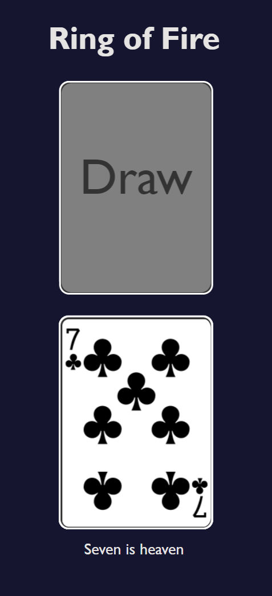

# Ring of Fire

Ring of Fire is a fun and exciting drinking card game that is perfect for parties and game nights with friends. The game is easy to learn and play, and can be modified to fit the preferences of your group.

This version of Ring of Fire is played online and the deck is shuffled automatically.

## Gameplay

The player to the left of the dealer starts the game by playing a card from their hand according to the following rules:

- If the played card is an Ace, everyone must drink until the player on their right stops drinking or finishes their drink. The player who played the Ace can stop drinking at any time.
- If the played card is a 2, the player who played the card gets to choose who must drink.
- If the played card is a 3, the player who played the card must drink.
- If the played card is a 4, all players who identify as female must drink.
- If the played card is a 5, all players must place their thumbs on the table. The last player to do so must drink.
- If the played card is a 6, all players who identify as male must drink.
- If the played card is a 7, all players must point their index fingers to the sky. The last player to do so must drink.
- If the played card is an 8, the player who played the card gets to choose who must drink, and the player who played the card must also drink.
- If the played card is a 9, the player who played the card must come up with a word, and then play continues around the circle with each player saying a word that rhymes with the first word. The first player who can't come up with a word must drink.
- If the played card is a 10, the player who played the card must choose a category (e.g. car brands), and then play continues around the circle with each player naming something in that category. The first player who can't think of an answer must drink.
- If the played card is a Jack, the player who played the card must come up with a new rule for the game that must be followed until the end of the round.
- If the played card is a Queen, play continues around the circle with each player asking a question. The first player who can't think of a question must drink. Answering is prohibited.
- If the played card is a King, the player who played the card must pour some of their drink into the cup. The last player to draw a King must drink the contents of the cup.

### Notes

At the moment deck refreshes when the page is loaded.
NOTE! This means that if another client opens this page the first client has their deck resuffled.
This is because the deck lives in the API and all clients use the same deck.
Not a problem as long as this page is only used by the author but later some client based deck should be implemented.